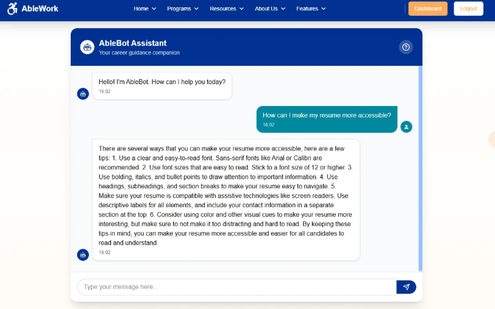

<h1 align="center"> AbleWork </h1> <br>
<p align="center">
  <a href="https://ablework.vercel.app">
    
  </a>
</p>

<p align="center">
  <a href="https://www.find-it.id/competition/hackathon" target="_blank"><b>FindIT Hackathon - 2025</b></a><br>
  <b>AbleWork</b> adalah <b>aplikasi web inklusif</b> yang dirancang sebagai gerbang karier bagi penyandang disabilitas, memberikan akses menuju kesempatan kerja yang setara, inklusif, dan memberdayakan.
</p>

---

## 📃 Daftar Isi
- [Bahasa](#bahasa)
- [Dokumentasi Lengkap](#dokumentasi-lengkap)
- [Semua Repository GitHub](#semua-repository-github)
- [Pendahuluan](#pendahuluan)
- [Teknologi yang Digunakan](#teknologi-yang-digunakan)
- [Fitur Utama](#fitur-utama)
- [Demo Langsung](#demo-langsung)
- [Menjalankan Secara Lokal](#menjalankan-secara-lokal)
- [Tangkapan Layar](#tangkapan-layar)
- [Diagram Arsitektur](#diagram-arsitektur)
- [Tim](#tim)
- [Kontak](#kontak)

---

## 🌆 Bahasa
<ul>
    <li><b>README Dokumentasi dalam Bahasa Inggris</b></li>
    <a href="https://github.com/StyNW7/AbleWork/blob/main/README.md">README Versi Inggris</a>
</ul>

---

## 📚 Dokumentasi Lengkap
<ul>
    <li><b>Dokumentasi Notion (Lengkap)</b></li>
    <a href="https://stanley-n-wijaya.notion.site/AbleWork-Documentation-1d473555b71f80eaabd6d8bc29d63153?pvs=4">Notion Documentation</a>
    <li><b>Pitch Deck</b></li>
    <a href="https://www.canva.com/design/DAGkZp_YX00/HMfsMXua5E5T0UG227PWNQ/edit?utm_content=DAGkZp_YX00&utm_campaign=designshare&utm_medium=link2&utm_source=sharebutton">Canva PowerPoint Pitch Deck</a>
    <li><b>Video Demo</b></li>
    <a href="https://drive.google.com/drive/folders/1XjZfySvS92iNH79hF5l6FU3b2-mCguZh?usp=sharing">Link Demo Video (Google Drive)</a>
    <li><b>Google Drive AbleWork</b></li>
    <a href="https://drive.google.com/drive/folders/1nOP9_njdFNmNuRJksGA6-yWUjZJkcVN5?usp=sharing">Dokumen Lengkap</a>
</ul>

---

## 🌐 Semua Repository GitHub
<ul>
    <li><b>Repository Utama</b></li>
    <a href="https://github.com/stynw7/ablework">https://github.com/StyNW7/AbleWork</a>
    <li><b>Frontend</b></li>
    <a href="https://github.com/stynw7/ablework-frontend">https://github.com/StyNW7/AbleWork-Frontend</a>
    <li><b>Backend</b></li>
    <a href="https://github.com/nathanielalex/ablework_backend">https://github.com/nathanielalex/AbleWork_backend</a>
    <li><b>AI</b></li>
    <a href="https://github.com/stynw7/ablework-ai">https://github.com/StyNW7/AbleWork-ai</a>
</ul>

---

## 🌟 Pendahuluan
**AbleWork** memberdayakan penyandang disabilitas untuk menjelajahi dan membangun karier yang bermakna melalui daftar pekerjaan yang mudah diakses, alat AI cerdas, dan desain antarmuka yang humanis.

> "Kami percaya bahwa talenta tidak memiliki batas, dan setiap orang berhak mendapatkan kesempatan yang adil untuk berkembang di dunia kerja."  
> — *AbleWork Manifesto*

---

## 🛠️ Teknologi yang Digunakan
- **Frontend**: React Vite, TailwindCSS, ShadcnUI
- **Backend**: Express.js & Node.js
- **Database**: MongoDB Atlas
- **AI**: Python + Hugging Face API
- **Version Control**: Git & GitHub (Submodule Monorepo)
- **Deployment**:
  - Frontend & Backend: [Vercel](https://vercel.com)
  - Database: [MongoDB Atlas](https://www.mongodb.com/)
  - AI Server: [Railway](https://railway.app)

---

## 🧩 Fitur Utama

- 🧠 **AbleBot Chat AI**  
  Asisten virtual yang menjawab pertanyaan seputar resume, wawancara, hak disabilitas, dan dukungan aksesibilitas.

- 📈 **Job Recommendations AI**  
  AI cerdas yang merekomendasikan karier ideal berdasarkan input pengguna (skill, minat, dan latar belakang).

- 📃 **CV Review AI**  
  Menampilkan kekuatan dan saran perbaikan CV secara otomatis.

- 📄 **Resume Maker**  
  Belum punya CV? Buat langsung dari data yang kamu masukkan ke dalam form.

- 💼 **Job Board Inklusif**  
  Lowongan pekerjaan dari perusahaan inklusif dengan filter ramah disabilitas.

- 🔐 **Sistem Autentikasi Berdasarkan Peran**  
  Pengalaman yang disesuaikan untuk pencari kerja dan perusahaan.

- 🖥️ **UI/UX Ramah Aksesibilitas**  
  Desain responsif dengan mode kontras tinggi.

---

## 🚀 Demo Langsung
Akses aplikasi yang sudah ter-deploy:  
👉 [https://ablework.vercel.app](https://ablework.vercel.app)

Link tambahan:  
Backend: https://findit-ablework-backend.vercel.app/api/  
AI: https://ablework-ai-production.up.railway.app/

---

## 🧰 Menjalankan Secara Lokal (Monorepo)

### Syarat Awal
- **Node.js v18+**
- **Python 3** (untuk server AI)
- **Git**

### Clone & Setup Submodule
```bash
git clone https://github.com/StyNW7/AbleWork.git
cd ablework
git submodule update --init --recursive
```

### Jalankan Setup Script
```bash
chmod +x scripts/setup.sh
./scripts/setup.sh
```

### Jalankan Dev Mode dengan Makefile
Setelah `.env` semua service diatur:
```bash
make dev
```

Atau menggunakan Shell Script:
```bash
chmod +x scripts/dev.sh
./scripts/dev.sh update      # update semua submodule
./scripts/dev.sh frontend    # jalankan frontend
./scripts/dev.sh backend     # jalankan backend
./scripts/dev.sh ai          # jalankan AI
./scripts/dev.sh dev         # jalankan semuanya
```

Atau menjalankannya secara manual:

Frontend:
```bash
cd frontend
npm install
npm run dev
```

Backend:
```bash
cd backend
npm install
npm run dev
```

AI:
```bash
cd frontend
python -m venv venv
source venv/bin/activate
pip install -r requirements.txt
python main.py
```

---

## 🔐 Konfigurasi .env

### 📁 `ai/.env`
```
HF_API_KEY=isi_dengan_token_huggingface_anda
```

### 📁 `frontend/.env`
```
VITE_API_URL=http://localhost:8080/api/
VITE_AI_API_URL=http://localhost:5000/
```

### 📁 `backend/.env`
```
MONGO_URI=isi_dengan_uri_mongodb_anda
JWT_SECRET=isi_dengan_secret_token_anda
HUGGINGFACE_API_KEY=isi_dengan_token_huggingface
PORT=8080
AI_API=http://localhost:5000/
```

> 💡 File `.env.example` tersedia di tiap folder sebagai referensi.

---

## 🖼️ Tangkapan Layar

*Halaman Utama*
<p align="center">
  
</p>

*Daftar Lowongan Pekerjaan*
<p align="center">
  
</p>

*Chatbot AbleBot*
<p align="center">
  
</p>

---

## 🧭 Diagram Arsitektur

*Diagram ERD Database Backend:*
<p align="center">
  
</p>

Link detail diagram:
https://dbdiagram.io/d/ERD-AbleWork-67ac7d22263d6cf9a0e4147f

---

## 👥 Tim
Proyek ini dibuat untuk FindIT Hackathon 2025 oleh:

- **Stanley Nathanael Wijaya** – Hustler
- **Kezia Meilany Tandapai** – Hipster
- **Nathaniel Alexander** – Hacker

---

## 📬 Kontak
Jika ada pertanyaan atau ingin kolaborasi:

- 📧 Email: stanley.n.wijaya7@gmail.com
- 💬 Discord: `stynw7`

<code>Untuk dunia kerja yang ramah dan setara bagi semua 🌍💡</code>

