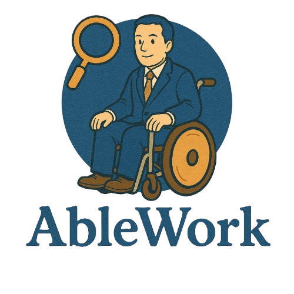
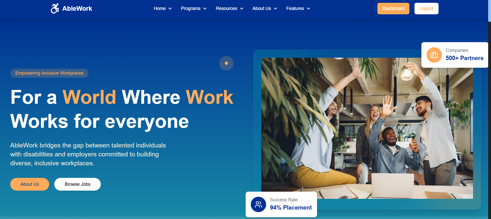
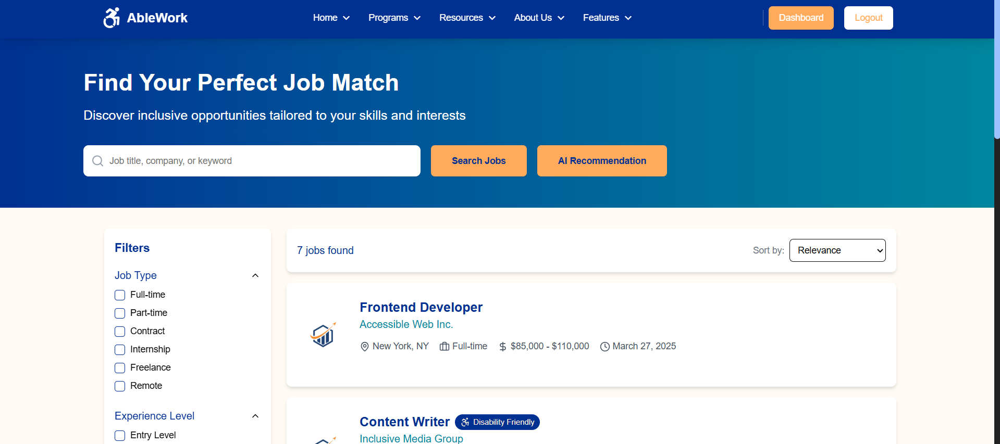
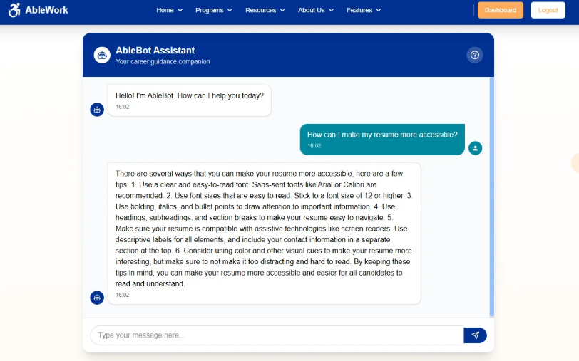

<h1 align="center"> AbleWork </h1> <br>
<p align="center">
  <a href="https://ablework.vercel.app">
    
  </a>
</p>

<p align="center">
  <a href="https://www.find-it.id/competition/hackathon" target="_blank"><b>FindIT Hackathon - 2025</b></a><br>
  <b>AbleWork</b> is an <b>inclusive web application</b> designed to become a career gateway for people with disabilities by enabling access to equal, inclusive, and empowering <b>employment opportunities.</b>
</p>

---

## 📃 Table of Contents
- [Complete Documentation](#complete-documentation)
- [Introduction](#introduction)
- [Technology Stack](#technology-stack)
- [Core Features](#core-features)
- [Live Demo](#live-demo)
- [Getting Started Locally](#getting-started-locally)
- [Screenshots](#screenshots)
- [Architecture Diagram](#architecture-diagram)
- [Team](#team)
- [Contact](#contact)

---

## 📚 Complete Documentation

<ul>
    <li><b>Notion Documentation (Detail)</b></li>
    <a href="https://stanley-n-wijaya.notion.site/AbleWork-Documentation-1d473555b71f80eaabd6d8bc29d63153?pvs=4">Notion Documentation</a>
    <li><b>Pitch Deck</b></li>
    <a href="https://www.canva.com/design/DAGkZp_YX00/HMfsMXua5E5T0UG227PWNQ/edit?utm_content=DAGkZp_YX00&utm_campaign=designshare&utm_medium=link2&utm_source=sharebutton">Canva PowerPoint Pitch Deck</a>
    <li><b>Demo Video</b></li>
    <a href="">Link Demo Video (Google Drive)</a>
    <li><b>Docs</b></li>
    <a href="">Docs (Google Drive)</a>
</ul>

---

## 🌟 Introduction
**AbleWork** empowers people with disabilities to explore and pursue meaningful careers through accessible job listings, AI-based career tools, and a human-centered design approach. This project aims to break down barriers to employment by integrating inclusive design and accessible technology.

> "We believe that talent knows no boundaries, and every person deserves a fair chance to thrive in the workplace."  
> — *AbleWork Manifesto*

---

## 🛠️ Technology Stack
- **Frontend**: React Vite, TailwindCSS, and ShadcnUI
- **Backend**: Express.js & Node.js
- **Database**: MongoDB Atlas
- **AI Integration**: Python  & Hugging Face API
- **Version Control**: Git & GitHub (Submodule Monorepo)
- **Deployment**:
  - Frontend & Backend: [Vercel](https://vercel.com)
  - Database: [MongoDB Atlas](https://www.mongodb.com/)
  - AI Server: [Railway](https://railway.app)

---

## 🧩 Core Features

- 🧠 **AbleBot Chat AI**  
  Virtual assistant answering questions about resumes, interviews, disability rights, and accessibility support.

- 📈 **Job Recommendations AI**  
  Smart AI that recommends ideal career paths based on user input (skills, interests, background).

- 💼 **Inclusive Job Board**  
  Job listings from inclusive companies with filters for disability-friendly roles.

- 🔐 **Role-Based Authentication System**  
  Distinct roles for job seekers and companies with tailored experiences.

- 🖥️ **Accessibility-First UI/UX**  
  High contrast mode and responsive design for all users.

---

## 🚀 Live Demo
Visit the deployed application here:  
👉 [https://ablework.vercel.app](https://ablework.vercel.app)

---

## 🧰 Getting Started Locally (Monorepo Version)

### Prerequisites
- **Node.js** (v18 or above)
- **Python 3** (for AI server)
- **Git**

### Clone Monorepo & Initialize Submodules
```bash
git clone https://github.com/yourusername/ablework.git
cd ablework
git submodule update --init --recursive
```

### Run Setup Script
```bash
chmod +x scripts/setup.sh
./scripts/setup.sh
```

### Run Dev Environment via Makefile
```bash
make dev
```

Or run each individually:
```bash
make frontend
make backend
make ai
```

---

## 🔐 .env Configuration
Each service in the monorepo requires its own `.env` file. Below are the required environment variables:

### 📁 `ai/.env`
```
HF_API_KEY=your_huggingface_api_key_here
```

### 📁 `frontend/.env`
```
VITE_API_URL=http://localhost:8080
VITE_AI_API_URL=http://localhost:5000
```

### 📁 `backend/.env`
```
MONGO_URI=your_mongodb_connection_string
JWT_SECRET=your_jwt_secret
HUGGINGFACE_API_KEY=your_huggingface_api_key_here
```

📌 You can create these files manually or copy from a provided `.env.example` file (recommended).

---

## 🖼️ Screenshots

*Welcome Page*
<p align="center">
  
</p>

*Job Listings*
<p align="center">
  
</p>

*AbleBot Chat in Action*
<p align="center">
  
</p>

---

## 🧭 ERD Diagram

*Overall Database System Flow:*
<p align="center">
  
</p>

This diagram shows how our models connected in the backend an database.

---

## 👥 Team
This project was created for FindIT Hackathon 2025 by:

- **Stanley Nathanael Wijaya** – Hustler
- **Kezia Meilany Tandapai** – Hipster
- **Nathaniel Alexander** – Hacker

---

## 📬 Contact
Have questions or want to collaborate?

- 📧 Email: stanley.n.wijaya7@gmail.com
- 💬 Discord: `stynw7`

<code>For a World Where Work Works for Everyone 🌍💡</code>
