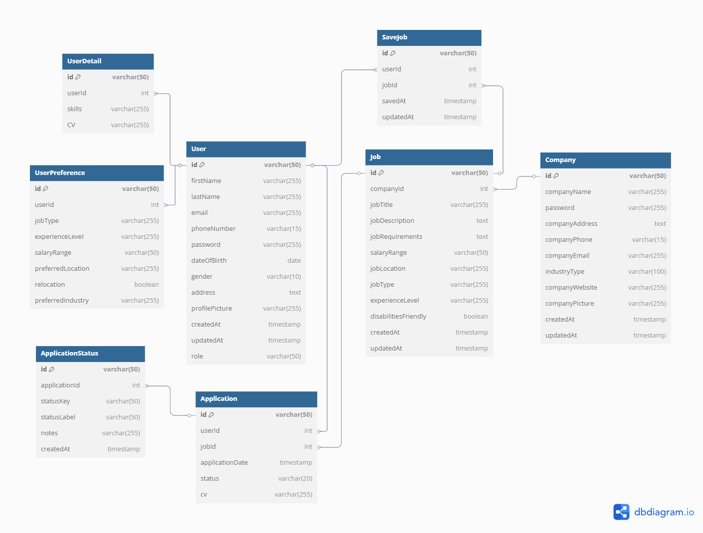

<h1 align="center"> AbleWork </h1> <br>
<p align="center">
  <a href="https://ablework.vercel.app">
    
  </a>
</p>

<p align="center">
  <a href="https://www.find-it.id/competition/hackathon" target="_blank"><b>FindIT Hackathon - 2025</b></a><br>
  <b>AbleWork</b> is an <b>inclusive web application</b> designed to become a career gateway for people with disabilities by enabling access to equal, inclusive, and empowering <b>employment opportunities.</b>
</p>

---

## 📃 Table of Contents
- [Language](#language)
- [Complete Documentation](#complete-documentation)
- [All GitHub Repository](#all-github-repository)
- [Introduction](#introduction)
- [Technology Stack](#technology-stack)
- [Core Features](#core-features)
- [Live Demo](#live-demo)
- [Getting Started Locally](#getting-started-locally)
- [Screenshots](#screenshots)
- [Architecture Diagram](#architecture-diagram)
- [Team](#team)
- [Contact](#contact)

---

## 🌆 Language

<ul>
    <li><b>README Documentation in Indonesia</b></li>
    <a href="https://github.com/StyNW7/AbleWork/blob/main/README-indo.md">README Indonesian Version</a>
</ul>

---

## 📚 Complete Documentation

<ul>
    <li><b>Notion Documentation (Detail Documentation)</b></li>
    <a href="https://stanley-n-wijaya.notion.site/AbleWork-Documentation-1d473555b71f80eaabd6d8bc29d63153?pvs=4">Notion Documentation</a>
    <li><b>Pitch Deck</b></li>
    <a href="https://www.canva.com/design/DAGkZp_YX00/HMfsMXua5E5T0UG227PWNQ/edit?utm_content=DAGkZp_YX00&utm_campaign=designshare&utm_medium=link2&utm_source=sharebutton">Canva PowerPoint Pitch Deck</a>
    <li><b>Demo Video</b></li>
    <a href="https://drive.google.com/drive/folders/1XjZfySvS92iNH79hF5l6FU3b2-mCguZh?usp=sharing">Link Demo Video (Google Drive)</a>
    <li><b>AbleWork Google Drive</b></li>
    <a href="https://drive.google.com/drive/folders/1nOP9_njdFNmNuRJksGA6-yWUjZJkcVN5?usp=sharing">Docs (Google Drive)</a>
</ul>

---

## 🌐 All GitHub Repository

<ul>
    <li><b>Main Repository</b></li>
    <a href="https://github.com/stynw7/ablework">https://github.com/StyNW7/AbleWork</a>
    <li><b>Frontend Repository</b></li>
    <a href="https://github.com/stynw7/ablework-frontend">https://github.com/StyNW7/AbleWork-Frontend</a>
    <li><b>Backend Repository</b></li>
    <a href="https://github.com/nathanielalex/ablework_backend">https://github.com/nathanielalex/AbleWork_backend</a>
    <li><b>AI Repository</b></li>
    <a href="https://github.com/stynw7/ablework-ai">https://github.com/StyNW7/AbleWork-ai</a>
</ul>

---


## 🌟 Introduction
**AbleWork** empowers people with disabilities to explore and pursue meaningful careers through accessible job listings, AI-based career tools, and a human-centered design approach. This project aims to break down barriers to employment by integrating inclusive design and accessible technology.

> "We believe that talent knows no boundaries, and every person deserves a fair chance to thrive in the workplace."  
> — *AbleWork Manifesto*

---

## 🛠️ Technology Stack
- **Frontend**: React Vite, TailwindCSS, and ShadcnUI
- **Backend**: Express.js & Node.js
- **Database**: MongoDB Atlas
- **AI Integration**: Python  & Hugging Face API
- **Version Control**: Git & GitHub (Submodule Monorepo)
- **Deployment**:
  - Frontend & Backend: [Vercel](https://vercel.com)
  - Database: [MongoDB Atlas](https://www.mongodb.com/)
  - AI Server: [Railway](https://railway.app)

---

## 🧩 Core Features

- 🧠 **AbleBot Chat AI**  
  Virtual assistant answering questions about resumes, interviews, disability rights, and accessibility support.

- 📈 **Job Recommendations AI**  
  Smart AI that recommends ideal career paths based on user input (skills, interests, background).

- 📃 **CV Review AI**  
  Smart AI that display strengths and improvements for your CV, so you can make it better!

- 📄 **Resume maker**  
  Confuse where to start? Just make your own CV by inputing your data on AbleWork Resume Maker.

- 💼 **Inclusive Job Board**  
  Job listings from inclusive companies with filters for disability-friendly roles.

- 🔐 **Role-Based Authentication System**  
  Distinct roles for job seekers and companies with tailored experiences.

- 🖥️ **Accessibility-First UI/UX**  
  High contrast mode and responsive design for all users.

---

## 🚀 Live Demo
Visit the deployed application here (fully deployed):
<br>
👉 [https://ablework.vercel.app](https://ablework.vercel.app)

If you want to check deployment for Backend and AI:
<br>
Backend: https://findit-ablework-backend.vercel.app/api/
<br>
AI: https://ablework-ai-production.up.railway.app/

---

## 🧰 Getting Started Locally (Monorepo Version)

### Prerequisites
- **Node.js** (v18 or above)
- **Python 3** (for AI server)
- **Git**

### Clone Monorepo & Initialize Submodules
```bash
git clone https://github.com/StyNW7/AbleWork.git
cd ablework
git submodule update --init --recursive
```

### Run Setup Script
Make sure run this using git bash
```bash
chmod +x scripts/setup.sh
./scripts/setup.sh
```

### Run Dev Environment via Makefile or Shell Script or Manually
[Prerequisite: Setup the .env files for Frontend, Backend, and AI.](#.env-configuration)
<br>
Then Run this command
```bash
make dev
```

Or if you prefer using Shell Script, you can run this:
```bash
chmod +x scripts/dev.sh
./scripts/dev.sh update      # update semua submodule
./scripts/dev.sh frontend    # jalankan frontend
./scripts/dev.sh backend     # jalankan backend
./scripts/dev.sh ai          # jalankan AI
./scripts/dev.sh dev         # jalankan semuanya
```

Or if you prefer manually you can do this:

Frontend:
```bash
cd frontend
npm install
npm run dev
```

Backend:
```bash
cd backend
npm install
npm run dev
```

AI:
```bash
cd frontend
python -m venv venv
source venv/bin/activate
pip install -r requirements.txt
python main.py
```

---

## 🔐 .env Configuration
Each service in the monorepo requires its own `.env` file. Below are the required environment variables:

### 📁 `ai/.env`
```
HF_API_KEY=your_huggingface_api_key_here
```

### 📁 `frontend/.env`
```
VITE_API_URL=http://localhost:8080/api/
VITE_AI_API_URL=http://localhost:5000/
```

### 📁 `backend/.env`
```
MONGO_URI=your_mongodb_connection_string
JWT_SECRET=your_jwt_secret
HUGGINGFACE_API_KEY=your_huggingface_api_key_here
PORT=8080
AI_API=http://localhost:5000/
```

📌 You can create these files manually or copy from a provided `.env.example` file (recommended).

---

## 🖼️ Screenshots

*Welcome Page*
<p align="center">
  
</p>

*Job Listings*
<p align="center">
  
</p>

*AbleBot Chat in Action*
<p align="center">
  
</p>

---

## 🧭 ERD Diagram

*Overall Database System Flow:*
<p align="center">
  
</p>

This diagram shows how our models connected in the backend an database.

Detail Diagram:
https://dbdiagram.io/d/ERD-AbleWork-67ac7d22263d6cf9a0e4147f 

---

## 👥 Team
This project was created for FindIT Hackathon 2025 by:

- **Stanley Nathanael Wijaya** – Hustler
- **Kezia Meilany Tandapai** – Hipster
- **Nathaniel Alexander** – Hacker

---

## 📬 Contact
Have questions or want to collaborate?

- 📧 Email: stanley.n.wijaya7@gmail.com
- 💬 Discord: `stynw7`

<code>For a World Where Work Works for Everyone 🌍💡</code>
